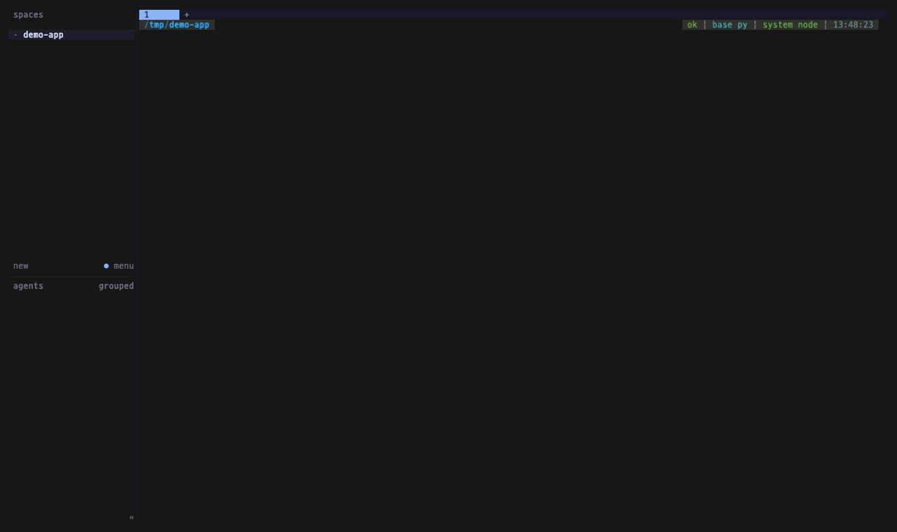

# orch

**터미널에 AI 에이전트 팀을 띄우고, 오케스트레이터 하나가 그들을 부린다.**
[herdr](https://herdr.dev) 위에서 도는 얇은 bash 레이어 — 팀 프리셋, 팬 간 메시징, 워크스페이스 격리.

```bash
orch 4 --team dev          # 개발팀 4명 (PM·테크리드·디자이너·풀스택)
orch --status              # 누가 일하고 누가 막혔는지
orch --reharness           # 규칙을 바꿨다 → 대화는 유지한 채 하네스만 재구축
```

<!-- 데모 GIF를 여기에: 15~30초, 5MB 이하 -->
<!--  -->

---

## 뭘 해결하나

에이전트를 하나 쓰는 건 쉽다. 아홉 개를 동시에 돌리는 순간 다른 문제가 생긴다.

| 문제 | orch가 하는 것 |
|---|---|
| 매번 역할 프롬프트를 손으로 붙여넣는다 | **팀 프리셋** — 역할·책임·가이드가 JSON 하나에 |
| 누가 멈췄는지 창을 하나씩 열어봐야 안다 | `orch --status` — 워크스페이스 단위 상태표 |
| 에이전트끼리 주고받은 게 어디에도 안 남는다 | `orch-msg` — 파일 로그가 진실 원본 |
| 스페이스 두 개를 띄우면 메시지가 남의 팀으로 간다 | **워크스페이스 격리** — pane_id 접두사로 강제 |
| 규칙을 고치면 팀을 새로 띄워야 한다 | `--reharness` — 맥락 유지한 채 프롬프트만 교체 |

## 필요한 것

| | 버전·비고 |
|---|---|
| [herdr](https://herdr.dev) | 0.7.5+ · **Linux·macOS 안정, Windows는 프리뷰 베타** |
| [Claude Code](https://claude.com/claude-code) | `claude` 명령이 PATH에 |
| `bash` | 3.2+ (macOS 기본 포함) |
| `jq` | JSON 파싱 |

> **Windows 사용자는 [INSTALL.md](INSTALL.md#windows)를 먼저 읽으세요.**
> herdr Windows 빌드가 프리뷰라 **WSL2 경로를 권장**합니다.

## 설치

```bash
git clone https://github.com/<당신>/orch-kit.git
cd orch-kit
./install.sh
```

`install.sh`가 하는 일은 두 가지뿐입니다 — `bin/*`를 PATH에 링크하고, `config/*`를 `~/.config/herdr/orch/`에 복사합니다. 기존 파일은 덮어쓰기 전에 물어봅니다.

OS별 상세는 [INSTALL.md](INSTALL.md)를 보세요.

## 5분 시작

```bash
herdr                                 # herdr 실행 (팬 안에서 아래를 친다)
orch --list-teams                     # 어떤 팀이 있나
orch 4 --team dev --cwd ~/myproject   # 개발팀 4명을 내 프로젝트에서
```

왼쪽 50%에 **orch**(오케스트레이터), 오른쪽에 에이전트 4개가 뜹니다.
5개를 넘으면 새 탭에 3×3 그리드로 배치됩니다.

**orch 팬에만 말하세요.** 개별 에이전트에게 직접 지시하면 오케스트레이터가 누가 뭘 하는지 몰라 중복·누락이 생깁니다.

## 기본 팀 프리셋

업계 표준 조직 구조를 조사해 만들었습니다. 각 9역할이고, `N`을 주면 우선순위 순으로 잘라 씁니다.

| 프리셋 | 기반 | 최소 4인 구성 |
|---|---|---|
| `dev` | Spotify Squad / Amazon Two-Pizza | PM · 테크리드 · 디자이너 · 풀스택 |
| `marketing` | 수요창출25/콘텐츠20/옵스15 배분 | 총괄 · 퍼포먼스 · 콘텐츠 · 옵스 |
| `content` | 단일 에디터 승인 + 병렬 트랙 | 매니저 · 라이터 · SEO · 디자이너 |
| `video` | 프리/프로덕션/포스트 3단계 | 프로듀서 · 작가 · 감독 · 비주얼생성 |
| `growth` | Sean Ellis / Reforge 주간 실험 | 리드 · 분석가 · 엔지니어 · 마케터 |

**`video`는 AI 팀에 맞게 각색했습니다.** 에이전트는 물리 촬영을 못 하므로 '촬영감독'을 '비주얼생성'으로 바꾸고, 실물 촬영팀에 없는 **AI티 검수** 역할을 최종 게이트로 넣었습니다.

직접 만들려면 `config/teams/dev.json`을 복사해 고치세요. 스키마는 [docs/TEAMS.md](docs/TEAMS.md)에 있습니다.

## 위키를 주면 팀을 짜줍니다

```bash
orch --wiki ~/myproject/docs
```

헤드리스 claude가 문서를 읽고 **이 프로젝트에 맞는 역할 구성을 JSON으로 뽑은 뒤** 그대로 팬을 만듭니다. 프리셋 하나에 안 맞으면 혼합 구성을 짭니다.

## 에이전트 간 통신

```bash
orch-msg send 코어작가 '초안 검토 부탁'   # 역할명(팬 라벨)으로
orch-msg log --last 30                   # 최근 대화
orch-msg who                             # 내 워크스페이스 팀원
```

**두 가지 설계 결정이 있습니다.**

첫째, **파일 로그가 진실 원본**입니다. 팬 전달은 상대가 작업 중이면 유실될 수 있어서, `<cwd>/comms/log.md`에 남는 기록을 정본으로 봅니다. 5MB를 넘으면 자동 회전합니다.

둘째, **워크스페이스를 절대 넘지 않습니다.** herdr가 모든 팬에 주입하는 `HERDR_WORKSPACE_ID`를 신원으로 쓰고, 대상이 다른 스페이스면 전송을 **거부**합니다. 포커스된 스페이스로 폴백하지 않습니다 — 신원을 모르면 보내지 않고 죽는 쪽이 맞습니다.

## `--reharness`

규칙(`CLAUDE.md`)이나 가이드를 고쳤을 때, 팀을 새로 띄우지 않고 하네스만 다시 세웁니다.

```bash
orch --reharness --dry-run   # 프롬프트만 재생성해서 확인
orch --reharness             # 각 팬을 --resume 으로 재기동
```

프로젝트의 `CLAUDE.md`와 최근 산출물 목록을 다시 읽어 시스템 프롬프트를 갱신하고, **대화 맥락은 `--resume`으로 유지**합니다. 팀 프리셋에 없는 역할(운영 중 추가된 것)도 공통 규칙을 받습니다.

## 안 하는 것

- **소셜·외부 계정에 아무것도 게시하지 않습니다.** 원고를 만들 뿐입니다.
- **MCP·플러그인을 임의로 설치하지 않습니다.** 인증·과금이 걸리므로 명령어만 제안합니다.
- **`herdr pane run`·`pane close`는 권한 허용 목록에서 일부러 뺐습니다.** 새 에이전트 생성과 팬 삭제에는 승인이 남습니다 — 의도된 안전장치입니다.

## 비용 주의

Anthropic 공식 자료 기준 **멀티에이전트는 일반 채팅 대비 약 15배 토큰**을 씁니다(단일 에이전트 ~4배).
에이전트 수는 *가진 도구의 수용량*이 아니라 **실제로 병렬화 가능한 작업 수**에 맞추세요. 4개로 시작해 병목이 보일 때 늘리는 편이 거의 항상 낫습니다.

순차 의존인 작업(A가 끝나야 B가 시작)은 멀티에이전트로 나눠도 이득이 없습니다.

## 문서

- [INSTALL.md](INSTALL.md) — OS별 설치 (Windows·Linux·macOS)
- [docs/TEAMS.md](docs/TEAMS.md) — 팀 프리셋 스키마
- [docs/TROUBLESHOOTING.md](docs/TROUBLESHOOTING.md) — 안 될 때
- [docs/ARCHITECTURE.md](docs/ARCHITECTURE.md) — 어떻게 도는가

## 라이선스

MIT. herdr와 Claude Code는 각자의 라이선스를 따릅니다 — 이 저장소는 그 위에서 도는 스크립트만 담고 있고, 두 프로젝트와 제휴 관계가 없습니다.
